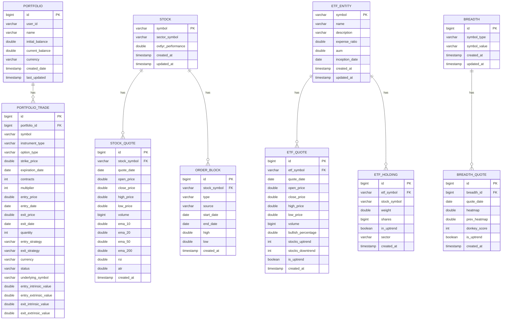

# Database Entity-Relationship Diagram

## Full ER Diagram (Mermaid)



## Table Descriptions

### Core Tables

#### 1. **PORTFOLIO**
- **Purpose**: User's trading portfolio
- **Key**: Auto-increment ID
- **Relationships**: Has many PORTFOLIO_TRADE
- **Indexes**: user_id

#### 2. **PORTFOLIO_TRADE**
- **Purpose**: Individual trades within a portfolio
- **Key**: Auto-increment ID
- **Relationships**: Belongs to PORTFOLIO
- **Indexes**: portfolio_id, symbol, entry_date, status
- **Notes**: Supports stocks, options, and leveraged ETFs

#### 3. **STOCK**
- **Purpose**: Stock information
- **Key**: symbol (natural key)
- **Relationships**: Has many STOCK_QUOTE, ORDER_BLOCK
- **Indexes**: sector_symbol

#### 4. **STOCK_QUOTE**
- **Purpose**: Historical stock price data with technical indicators
- **Key**: Auto-increment ID
- **Relationships**: Belongs to STOCK
- **Indexes**:
  - (stock_symbol, quote_date) - UNIQUE
  - quote_date
- **Volume**: High - thousands of records per stock

#### 5. **ORDER_BLOCK**
- **Purpose**: Support/resistance zones for stocks
- **Key**: Auto-increment ID
- **Relationships**: Belongs to STOCK
- **Indexes**: stock_symbol, start_date, type
- **Notes**: Can be BULLISH or BEARISH, from CALCULATED or OVTLYR source

#### 6. **ETF_ENTITY**
- **Purpose**: ETF information and metadata
- **Key**: symbol (natural key)
- **Relationships**: Has many ETF_QUOTE, ETF_HOLDING
- **Notes**: Stores expense ratio, AUM, inception date

#### 7. **ETF_QUOTE**
- **Purpose**: Historical ETF price data with breadth metrics
- **Key**: Auto-increment ID
- **Relationships**: Belongs to ETF_ENTITY
- **Indexes**:
  - (etf_symbol, quote_date) - UNIQUE
  - quote_date
- **Notes**: Includes bullish percentage and uptrend counts

#### 8. **ETF_HOLDING**
- **Purpose**: ETF constituent holdings with weights
- **Key**: Auto-increment ID
- **Relationships**: Belongs to ETF_ENTITY
- **Indexes**: etf_symbol, stock_symbol
- **Notes**: Updated periodically from data provider

#### 9. **BREADTH**
- **Purpose**: Market or sector breadth data container
- **Key**: Auto-increment ID
- **Relationships**: Has many BREADTH_QUOTE
- **Notes**: symbol_type can be "MARKET" or "SECTOR"

#### 10. **BREADTH_QUOTE**
- **Purpose**: Historical breadth metrics (heatmap, donkey score)
- **Key**: Auto-increment ID
- **Relationships**: Belongs to BREADTH
- **Indexes**: breadth_id, quote_date

## Data Cardinality

| Relationship | Type | Typical Count |
|--------------|------|---------------|
| Portfolio → Trades | 1:N | 1 → 10-1000 |
| Stock → Quotes | 1:N | 1 → 1000-5000 |
| Stock → OrderBlocks | 1:N | 1 → 10-100 |
| ETF → Quotes | 1:N | 1 → 1000-5000 |
| ETF → Holdings | 1:N | 1 → 50-500 |
| Breadth → Quotes | 1:N | 1 → 500-2000 |

## Index Strategy

### Primary Indexes (Auto-created)
- All PRIMARY KEY columns
- All FOREIGN KEY columns (most databases)

### Custom Indexes (Performance-critical)

```sql
-- Portfolio trades by status
CREATE INDEX idx_trade_status ON portfolio_trade(status);

-- Portfolio trades by portfolio and date
CREATE INDEX idx_trade_portfolio_date ON portfolio_trade(portfolio_id, entry_date DESC);

-- Stock quotes by date (for range queries)
CREATE INDEX idx_stock_quote_date ON stock_quote(quote_date);

-- Stock quotes by symbol and date (for single stock queries)
CREATE UNIQUE INDEX idx_stock_quote_symbol_date ON stock_quote(stock_symbol, quote_date);

-- ETF quotes by date
CREATE INDEX idx_etf_quote_date ON etf_quote(quote_date);

-- ETF quotes by symbol and date
CREATE UNIQUE INDEX idx_etf_quote_symbol_date ON etf_quote(etf_symbol, quote_date);

-- ETF holdings by symbol
CREATE INDEX idx_etf_holding_etf ON etf_holding(etf_symbol);

-- Order blocks by stock
CREATE INDEX idx_order_block_stock ON order_block(stock_symbol);

-- Order blocks by type and active status
CREATE INDEX idx_order_block_type_active ON order_block(type, end_date);

-- Breadth quotes by breadth_id and date
CREATE INDEX idx_breadth_quote_breadth_date ON breadth_quote(breadth_id, quote_date);
```

## Storage Estimates

### Typical Production Dataset

| Table | Records | Avg Size | Total Size |
|-------|---------|----------|------------|
| portfolios | 10 | 200 bytes | 2 KB |
| portfolio_trades | 1,000 | 500 bytes | 500 KB |
| stocks | 1,000 | 200 bytes | 200 KB |
| stock_quotes | 1,000,000 | 150 bytes | 150 MB |
| order_blocks | 10,000 | 100 bytes | 1 MB |
| etf_entities | 100 | 300 bytes | 30 KB |
| etf_quotes | 100,000 | 150 bytes | 15 MB |
| etf_holdings | 10,000 | 100 bytes | 1 MB |
| breadth | 50 | 100 bytes | 5 KB |
| breadth_quotes | 50,000 | 100 bytes | 5 MB |
| **TOTAL** | **~1,161,160** | | **~172 MB** |

### With Indexes
- Additional 20-30% overhead for indexes
- **Total with indexes: ~220 MB**

### H2 Compression
- H2 can compress file-based databases
- Expected compression: 40-50%
- **Final database file: ~110-130 MB**

## Query Patterns

### Common Queries and Their Complexity

#### 1. Get Portfolio with All Trades
```sql
SELECT p.*, t.*
FROM portfolio p
LEFT JOIN portfolio_trade t ON p.id = t.portfolio_id
WHERE p.id = ?
```
**Complexity**: O(1) for portfolio + O(n) for trades where n = number of trades

#### 2. Get Stock with Quotes in Date Range
```sql
SELECT s.*, q.*
FROM stock s
LEFT JOIN stock_quote q ON s.symbol = q.stock_symbol
WHERE s.symbol = ?
  AND q.quote_date BETWEEN ? AND ?
ORDER BY q.quote_date ASC
```
**Complexity**: O(log n) index seek + O(m) where m = quotes in range

#### 3. Get ETF with Latest Quote and Holdings
```sql
SELECT e.*, q.*, h.*
FROM etf_entity e
LEFT JOIN etf_quote q ON e.symbol = q.etf_symbol
LEFT JOIN etf_holding h ON e.symbol = h.etf_symbol
WHERE e.symbol = ?
  AND q.quote_date = (SELECT MAX(quote_date) FROM etf_quote WHERE etf_symbol = e.symbol)
```
**Complexity**: O(log n) for latest quote + O(m) for holdings

#### 4. Calculate Portfolio Stats
```sql
SELECT
    COUNT(*) as total_trades,
    SUM(CASE WHEN exit_price > entry_price THEN 1 ELSE 0 END) as wins,
    SUM(exit_price * quantity - entry_price * quantity) as total_profit
FROM portfolio_trade
WHERE portfolio_id = ?
  AND status = 'CLOSED'
```
**Complexity**: O(n) single table scan with aggregation

## Migration Complexity

### From MongoDB Embedded Documents to Relational Tables

| MongoDB Document | H2 Tables | Complexity |
|------------------|-----------|------------|
| Stock + quotes[] | Stock + StockQuote | Medium - 1:N relationship |
| ETF + quotes[] + holdings[] | EtfEntity + EtfQuote + EtfHolding | Medium - 1:N relationships |
| Breadth + quotes[] | Breadth + BreadthQuote | Low - simple 1:N |
| Portfolio + trades[] | Portfolio + PortfolioTrade | Low - already separate in MongoDB |

**Total Migration Effort**: Medium
- Most relationships are straightforward 1:N
- No complex many-to-many relationships
- Data structure mapping is clear

## Referential Integrity

### Cascade Rules

```sql
-- Delete portfolio → delete all trades
ALTER TABLE portfolio_trade
ADD CONSTRAINT fk_trade_portfolio
FOREIGN KEY (portfolio_id) REFERENCES portfolio(id)
ON DELETE CASCADE;

-- Delete stock → delete all quotes and order blocks
ALTER TABLE stock_quote
ADD CONSTRAINT fk_quote_stock
FOREIGN KEY (stock_symbol) REFERENCES stock(symbol)
ON DELETE CASCADE;

ALTER TABLE order_block
ADD CONSTRAINT fk_orderblock_stock
FOREIGN KEY (stock_symbol) REFERENCES stock(symbol)
ON DELETE CASCADE;

-- Similar for ETF and Breadth
```

## Backup Strategy Impact

### File-Based Backup
- **Single file**: `trading.mv.db`
- **Backup time**: 1-2 seconds for 200MB
- **Restore time**: 2-3 seconds
- **Backup size**: ~110MB compressed

### SQL Backup
```sql
BACKUP TO 'backup.zip';
```
- Creates compressed SQL backup
- Portable across H2 versions
- Can be inspected/edited

### Export to SQL Script
```sql
SCRIPT TO 'backup.sql';
```
- Human-readable SQL
- Can be imported to other databases
- Useful for migrations

---

**Diagram Legend**:
- PK = Primary Key
- FK = Foreign Key
- ||--o{ = One-to-Many relationship
- Indexes shown in table descriptions above
